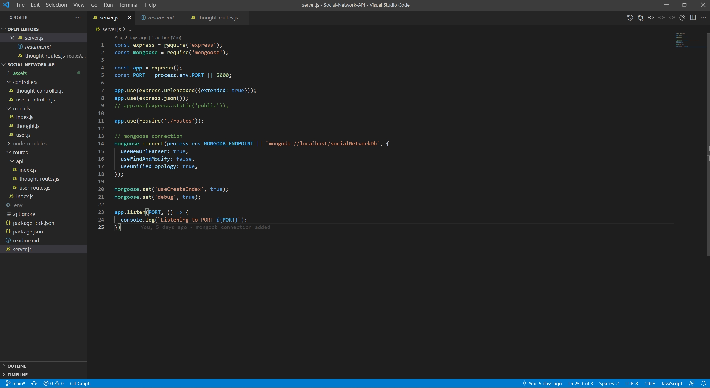

# Social Network API using MongoDB [](https://opensource.org/licenses/MIT)

## Description
This Repo contains code for performing CRUD operations for a social network API and the data created are stored in MongoDB using Mongoose.

## Build With
JavaScript, ES6, Node.js (Express, Mongoose, validator), MongoDB.

## Table of Contents
* [Installation](#Installation)
* [Usage](#Usage)
* [User-Story](#User-Story)
* [Acceptance-Criteria](#Acceptance-Criteria)
* [License](#License)
* [Contributing](#Contributing)
* [Screenshot](#Screenshot)
* [Questions](#Questions)

### Installation
Inorder to install the necessary dependencies, run ```npm install``` in your terminal.

### Usage
After installing all the dependencies, ```npm start``` in your terminal. For a walkthrough demo click here [!Demo](https://drive.google.com/file/d/1exM5gWe3681sWBaOD-dlaEEYLeWlmnvr/view?usp=sharing).

### User-Story
AS A social media startup<br>
I WANT an API for my social network that uses a NoSQL database<br>
SO THAT my website can handle large amounts of unstructured data<br>

### Acceptance-Criteria
GIVEN a social network API<br>
WHEN I enter the command to invoke the application<br>
THEN my server is started and the Mongoose models are synced to the MongoDB database<br>
WHEN I open API GET routes in Insomnia Core for users and thoughts<br>
THEN the data for each of these routes is displayed in a formatted JSON<br>
WHEN I test API POST, PUT, and DELETE routes in Insomnia Core<br>
THEN I am able to successfully create, update, and delete users and thoughts in my database<br>
WHEN I test API POST and DELETE routes in Insomnia Core<br>
THEN I am able to successfully create and delete reactions to thoughts and add and remove friends to a user’s friend list<br>
### License
This application is covered under **MIT** license.

### Contributing 
No contributions at the moment. If anyone wishes to provide contributions, please contact the author.

### Screenshot


### Questions
If you have any questions, please reach out to the<br>
Author: Janarthani V S <br>
Email : <vs.janarthani@gmail.com> <br>
Author's github profile: [GitHub](https://github.com/vsjanarthani)
